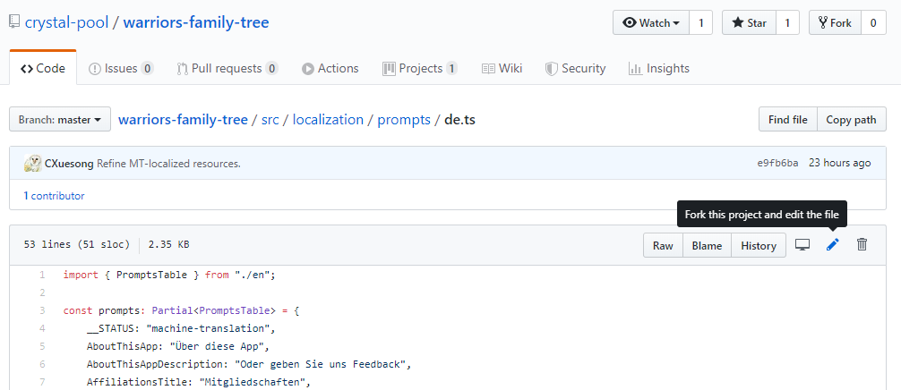
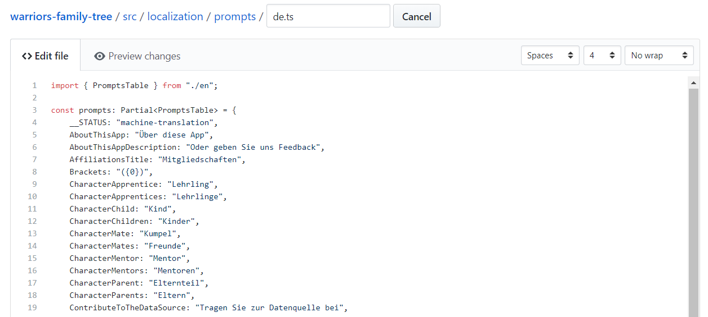
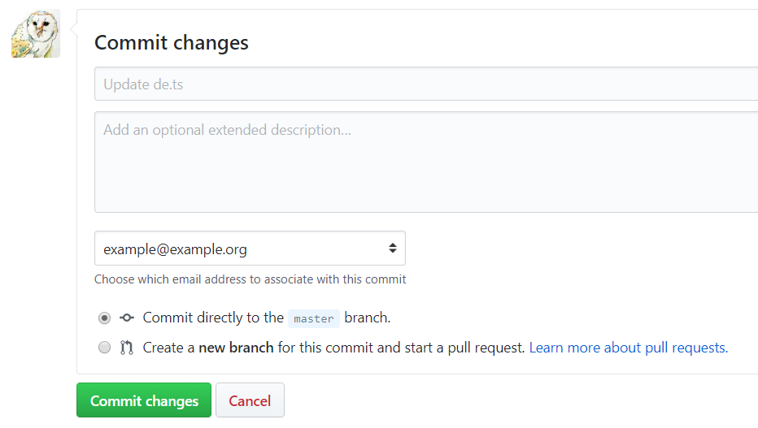
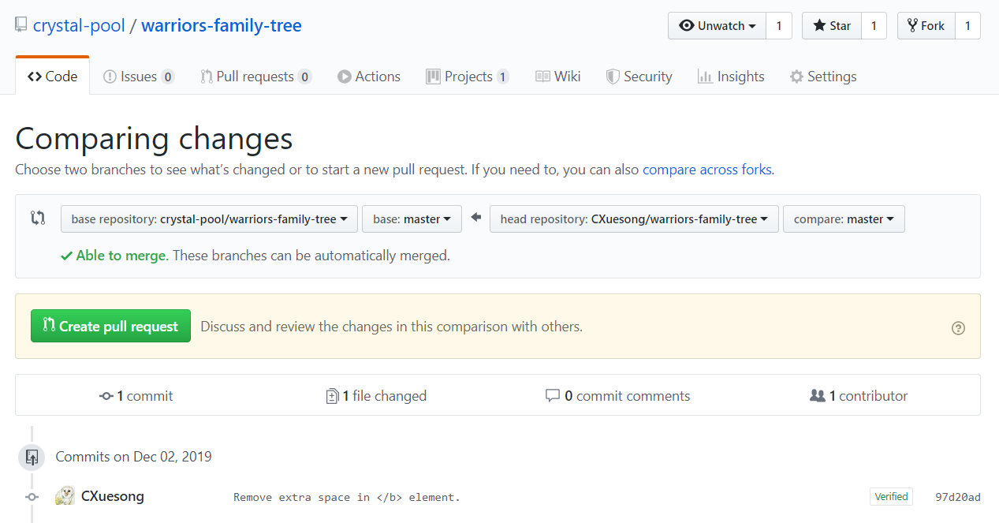
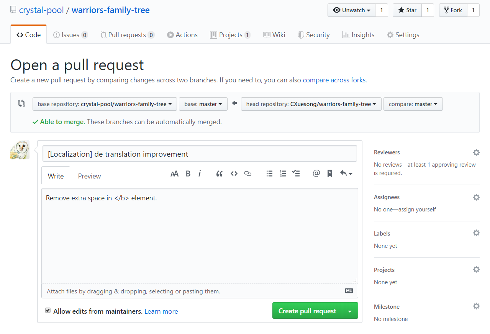

# Localization resource

If you are brought here by the "Machine Translation" tip in the **warriors-family-tree** app. Thank you for your time and patience!

This folder contains the translation for the *user interface* of **warriors-family-tree**. If you are going to add translations for the entities (e.g. cats, books, etc.), please refer to [Crystal Pool:Warriors Family Tree#Contributing to the data source](https://crystalpool.cxuesong.com/wiki/Crystal_Pool:Warriors_Family_Tree#Contributing_to_the_data_source).

Files in this folder use ISO 639-1 two-letter language codes as file names. See [List of ISO 639-1 codes](https://en.wikipedia.org/wiki/List_of_ISO_639-1_codes) for a table of all the available language codes and their corresponding language names.

## How to edit the files

Usually, you need to submit a [Pull Request](https://github.com/crystal-pool/warriors-family-tree/pulls) for any changes to this repository. If you are already familiar with this, excellent! You may well skip this section and get started. Make sure to read [#Propose a Pull Request](#propose-a-pull-prequest) before opening a PR.

If not, well, don't panic. Join the discord channel if necessary. You can find one [on the homepage of this repository](https://github.com/crystal-pool/warriors-family-tree#readme).

### Create a fork of the repository

First, you need to have a GitHub account. If not, please [sign up](https://github.com/join) for one.

Then, open the `.ts` file whose name corresponds the language you are going to improve translation on. You may see something like this

Click the Pen icon to the top-right side (Fork this project and edit the file).

Wait for a while, and you should see the editor.

### Edit the translations

Edit the translations (text surrounded by quotation marks starting from Line 5 on the graph below) with the guidance of the English content in `en.ts`.

Scroll down the page, and you should see the "Commit changes" form. You can either keep the default edit summary, or write something that might be interesting. Choose "Commit directly to the `master` branch." and click "Commit changes" to continue.

You can make several commits before proposing the PR. Please note that there is no way, solely on the GitHub website, to remove a certain commit, but you can always review the file history. You can find the "History" button on the first graph.

### Propose a Pull Request

Go to the [Pull Request](https://github.com/crystal-pool/warriors-family-tree/pulls) tab of the *original* repository on crystal-pool (rather than your own fork repository). Click "New pull request" button (the big, green one).

On "Comparing changes" page, click "compare across forks" link so you can see a dropdown button named "head repository". Click this dropdown button, and choose your own fork (usually in the form of `your_user_name/warriors-family-tree`). Choose in the "compare" dropdown if necessary, but usually the default one is good enough.

Scroll down the page to see the changes you are going to make. If they look good to you, click "Create pull request" button (the green one).

Write the title and description for the PR. Please make sure the title starts with `[Localization]`, and please include the language code(s) that you have changed the translation of.

If you are ready. Take a breath, click "Create pull request". We will review your PR and, if everything seems okay, merge it. After that, you can delete your fork repository (usually in the name of `your_user_name/warriors-family-tree`).

There are chances that you are left comments by the reviewer, so please keep coming back to check your PR once in a while. Note that you can still make edits in your fork repository, and the edits will be added to the PR automatically.

Finally, join the discord channel if necessary. You can find one [on the homepage of this repository](https://github.com/crystal-pool/warriors-family-tree#readme).

